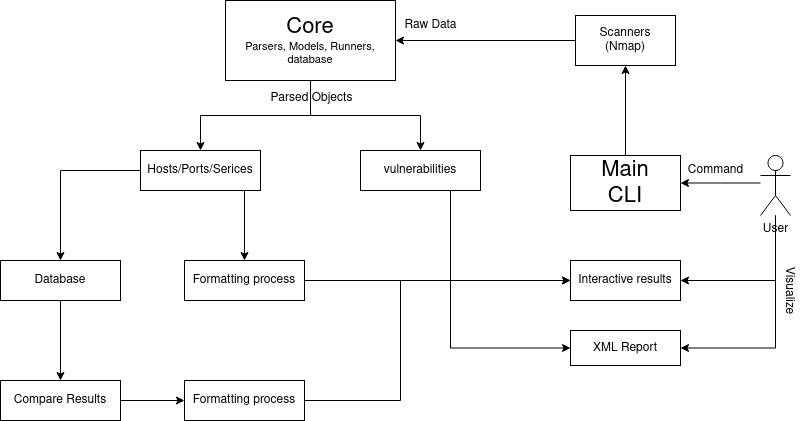
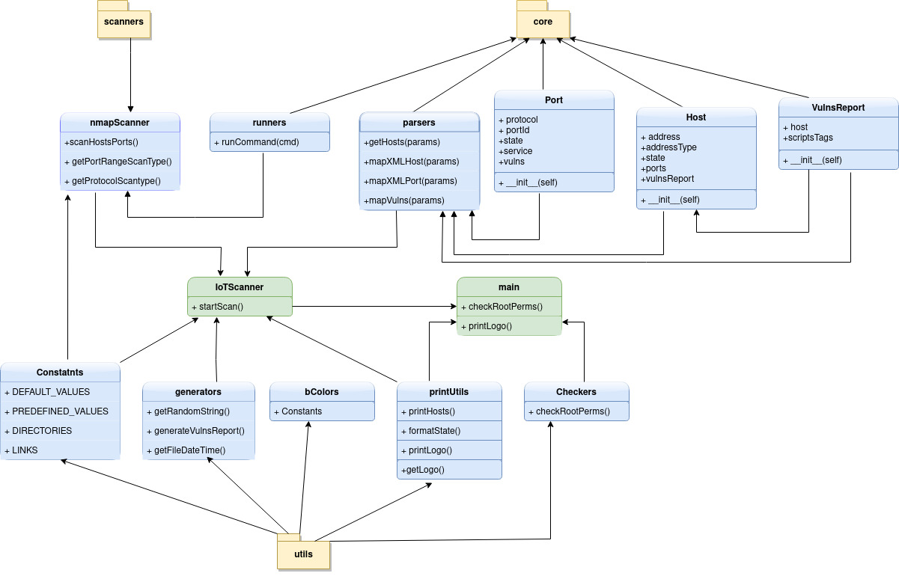

# Ubi-AutoSecure 

## Introduction 
This project is created for educational purposes to simulate an auto-scanning behavior on IoT devices called UbiQuarium, with Nmap, and its Scripting Engine, while providing reports through parsing processes.

## Global Structure 

The figure below present an overview on the communication between modules of the project, thus the data flow from user input to user output



## Technical Structure

If you are interested more in details about how python components are written (ie python classes, and functions), you find below a "UML Diagram" like for the project




## Usage

The main usage of the tool is the following: 

```bash
> python3 main.py -targets X.X.X.X [-scanType {ALL|FAST}] [-scanProtocol {TCP|UDP}] [-interface "name"] [-persist]
```

You can run : 

```bash
> python3 main.py --help 
```

For more informations about different options

#
